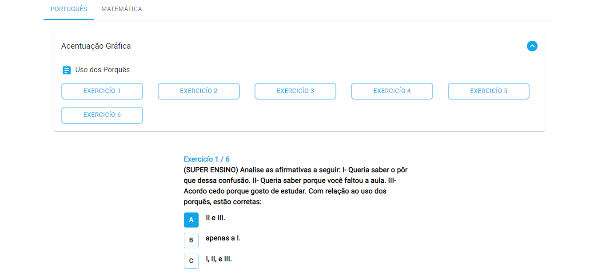

# Super Ensino

<!---Esses são exemplos. Veja https://shields.io para outras pessoas ou para personalizar este conjunto de escudos. Você pode querer incluir dependências, status do projeto e informações de licença aqui--->


💙 LINKEDIN 💙: [Lara Vitória](https://www.linkedin.com/in/laravitoria/)



> O objetivo do projeto é simular a organização simplificada de exercícios de alternativas

## 💻 Pré-requisitos

Antes de começar, verifique se você atendeu aos seguintes requisitos:

*Versão mais recente de:
[Node.js](https://nodejs.org/en/download/)


## ☕ Usando <Super Ensino>

Após a realização do clone do projeto. Para usar o projeto <Super Ensino>, siga estas etapas:

1º Instale as dependencias do Projeto

```sh
npm i
```
ou
```sh
yarn install
```

2º Inicie a Aplicação

```sh
npm rum dev
```
ou
```sh
yarn rum dev
```


## 📫 Contribuindo para <Super Ensino>
<!---Se o seu README for longo ou se você tiver algum processo ou etapas específicas que deseja que os contribuidores sigam, considere a criação de um arquivo CONTRIBUTING.md separado--->
Para contribuir com <nome_do_projeto>, siga estas etapas:

1. Bifurque este repositório.
2. Crie um branch: `git checkout -b <nome_branch>`.
3. Faça suas alterações e confirme-as: `git commit -m '<mensagem_commit>'`
4. Envie para o branch original: `git push origin <nome_do_projeto> / <local>`
5. Crie a solicitação de pull.

Como alternativa, consulte a documentação do GitHub em [como criar uma solicitação pull](https://help.github.com/en/github/collaborating-with-issues-and-pull-requests/creating-a-pull-request).


[⬆ Voltar ao topo](#nome-do-projeto)<br>
